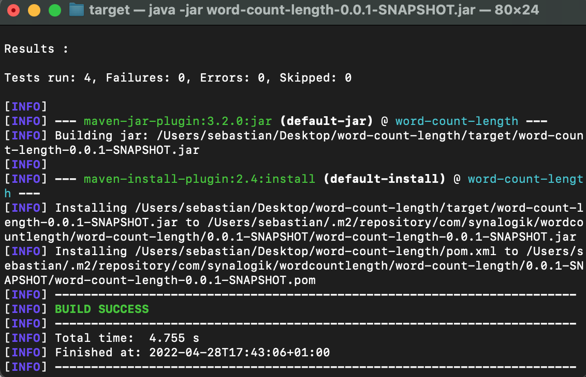

# Synalogik Java Programming Test Documentation

An API to read the contents of a plain text file and enable the display of the total number of words, the average word length, the most frequently occurring word length, and a list of the number of words of each length.

## Word Classification:

***A word can be classified as a string of valid characters that precede an invalid character and proceed the previous invalid character.***

### Character classification

The API works by evaluating each character in the plain text file and classifies it as a valid word contributor or not. Valid word contributors are characters that add to the word’s length count while invalid word contributors are characters that don’t contribute to a word’s length count and can end the word. 

However, there are some characters that can be valid and invalid dependent on the conditions of the characters before and after. These are to handle different cases of number formatting.

### Conditional Characters

| Character | Valid Example | Valid Reason | Invalid Example |
| --- | --- | --- | --- |
| , | €18,00 | European currency format | Hello, world |
| - | 18-9-2020 | Date format | Hello - world |
| . | 13.33 | Decimal format | good morning. The date |
| : | 18:22 | Time format | Word classification: invalid word |
| / | 18/09/19 | Date format | true/false  |

### Notable Unconditional Invalid Characters

| Character | Example |
| --- | --- |
| SPACE | Hello World |
| ? | Hello? |
| ‘’ | ‘Hello’ |
| “” | “Hello” |
| () | (World) |
| ; | Hello; |
| ! | Hello! |
| + | 12+8 |
| - | 20-8 |
| * | 12*8 |

Specification character classification

The specification example shows that the end of a word is dictated by a SPACE or correct punctuation and is not included in the word’s length count. Furthermore, the specification shows us that all characters in a date format contribute to the word length.

Personal character classification

I presumed that the classification of characters that aren’t used in the given are at my discretion. These are the following:

- Brackets
- Quotation, both single and double
- All forms of punctuation
- Mathematical symbols (with exception of conditional characters and %)

## Instructions:

### 1.0 Installation

1.1 Pull the repository from GitHub: [https://github.com/srodrichu/Word-Length-Count](https://github.com/srodrichu/Word-Length-Count)

1.2 Open the repo in terminal


1.3 Build the project using:

```bash
mvn clean install
```



Example of build

### 2.0 Launching program

2.1 In the terminal, access the /target folder

```bash
cd target
```

2.2 Run the following command to run the .jar file

```bash
java -jar word-count-length-0.0.1-SNAPSHOT.jar
```

### 3.0 Using the Program

3.1 You will be prompted to enter a path to a plain text file. Once entered press the enter key.


Example of path input

3.2 The results will be displayed in the terminal


Results

3.3 You will then be asked whether or not you want to run another file. Please enter either “y”, if you do, or “no” if you want to end the program.


Re-run program prompt